## Título do slide {.smaller}

**Subtítulo do slide**

<br>
Este é o texto do slide.

Este é um [link](https://github.com/mauriciovancine/course-intro-r-unicamp) do slide.

Este é um bloco de código. Notem a botão de cópia no canto superior direito.
```{r}
# comentario
sample(1:60, 6)
```

Esta é uma figura no slide.

<left>

</left>

::: footer
[Este é um link no rodapé](https://github.com/mauriciovancine/course-intro-r-unicamp)
:::

## Maurício Vancine

::::: columns
::: {.column width="40%"}
<center>
<br><br>

</center>
:::

::: {.column width="60%"}
-   Ecólogo e Doutor em Ecologia
-   Pós-Doc em Ecologia Espacial (Mathias Pires)
-   Ecologia Espacial
-   Modelagem Ecológica
-   Análise de Dados Geoespaciais
-   Ecologia e Conservação de Anfíbios
-   *Open source* \[R, QGIS, GRASS GIS, GNU/Linux\]
:::
:::::

::: footer
[mauriciovancine.github.io](https://mauriciovancine.github.io)
:::

## Análises Ecológicas no R (2022)

::::: columns
::: {.column width="50%"}
<br>
<center>
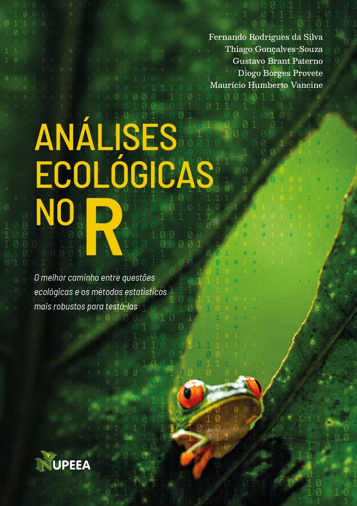
</center>
:::

::: {.column width="50%"}
::: {style="font-size: 80%;"}
<br>

-   **15 capítulos**: linguagem R, tidyverse, questões em ecologia, análises univariadas, multivariadas e espaciais
-   [bookdown](https://analises-ecologicas.com/)
-   [PDF](https://canal6.com.br/livreacesso/livro/analises-ecologicas-no-r/)
-   [Amazon](https://www.amazon.com.br/An%C3%A1lises-ecol%C3%B3gicas-Ferdo-Rodrigues-Silva/dp/857917564X/ref=sr_1_1?keywords=9788579175640&qid=1654379366&sr=8-1)
-   [Code](https://github.com/paternogbc/livro_aer)
-   [YouTube](https://www.youtube.com/channel/UCLSVSCnmvf2k6OoWZCnEO4w)
:::
:::
:::::

::: footer
[Da Silva et al. (2022)](https://analises-ecologicas.com/)
:::

## Ensino de R no Brazil (2026)

::: {style="font-size: 70%;"}
**Oecologia Australis - Special Issue**\
*Teaching Ecology: Challenges and Possibilities*
:::

**THE CHALLENGES AND NUANCES OF TEACHING THE R PROGRAMMING LANGUAGE TO ECOLOGISTS**

::: {style="font-size: 55%;"}
Maurício Humberto Vancine, Pavel Dodonov, Bruno Vilela, Luisa Diele-Viegas, Victor Casagrande Souza, Felipe Alvarez Silva Nunes, Ana Julia Oliveira Silva, Beatriz Milz, Cristina A. Kita, Marco A. R. Mello, Renata L. Muylaert
:::

::: {style="font-size: 70%;"}
- R como ferramenta essencial na Ecologia
- Desafios no ensino para estudantes de Biologia e Ecologia
- Importância da infraestrutura e fundamentos antes do aprendizado
- Dificuldades com conceitos abstratos e interpretação de resultados
- Impactos da COVID-19 e da IA no ensino
- Formação de profissionais com fortes habilidades analíticas
:::

::: footer
[Vancine et al. (2026)](https://revistas.ufrj.br/index.php/oa/article/view/64848)
:::

## Artigo da Mata Atlântica (2024)

{.absolute width=60% right=400 top=100}
{.absolute width=40% right=550 top=360}
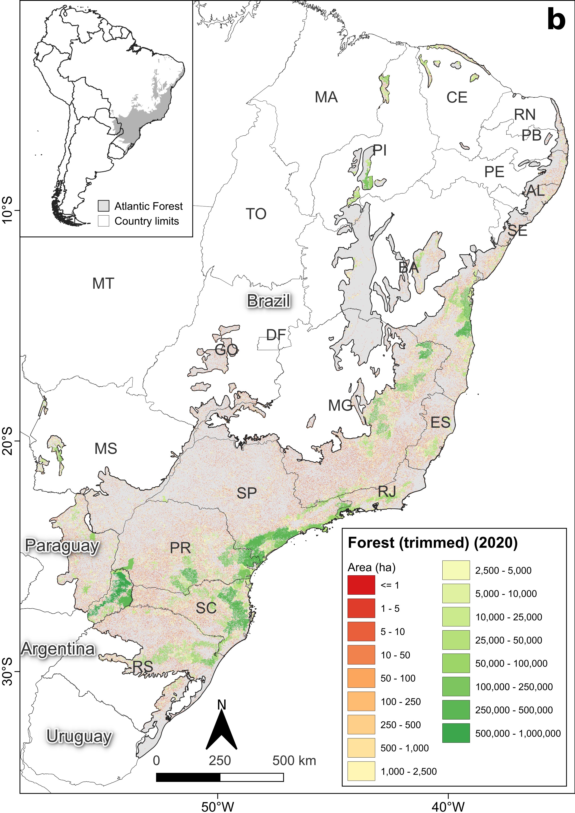{.absolute width=30% right=100 top=230}

::: footer
[Vancine et al. (2024)](https://doi.org/10.1016/j.biocon.2024.110499)
:::

## IMPORTANTE!!!

**Estamos num espaço seguro e amigável**

Sintam-se à vontade para me interromper e tirar dúvidas

<center>

</center>

::: footer
[\@allison_horst](https://twitter.com/allison_horst)
:::

## Conteúdo

::: panel-tabset
## Revisão
-   Revisão dos 11 principais conceitos em R/RStudio
-   Pseudocódigo

<center>

</center>

## Objetos e dados

::: {style="font-size: 85%;"}
-  Atributos dos objetos
-  Manejo de dados unidimensionais
-  Manejo de dados multidimensionais
-  Valores faltantes e especiais
-  Tabelas
-  Diretório de trabalho
-  Importar dados
-  Conferência de dados importados
-  Exportar dados
:::
:::

# Revisão

#

<center>

<center/>

## Revisão dos 11 principais conceitos em R

<br>

::::: columns
::: {.column width="50%"}
1.  Console
2.  Script (seções e subseções)
3.  Operadores
4.  Atribuição/Objetos
5.  Funções
6.  Pacotes (*packages*)
:::

::: {.column width="50%"}
7.  Ajuda (*help*)
8.  Ambiente (*environment*)
9.  Diretório
10. Citações
11. Projetos no Rstudio
:::
:::::

## Projeto R (.Rproj)

-   Facilita o trabalho em múltiplos ambientes
-   Cada projeto possui seu diretório, documentos e workspace
-   Permite controle de versão (git e GitHub)

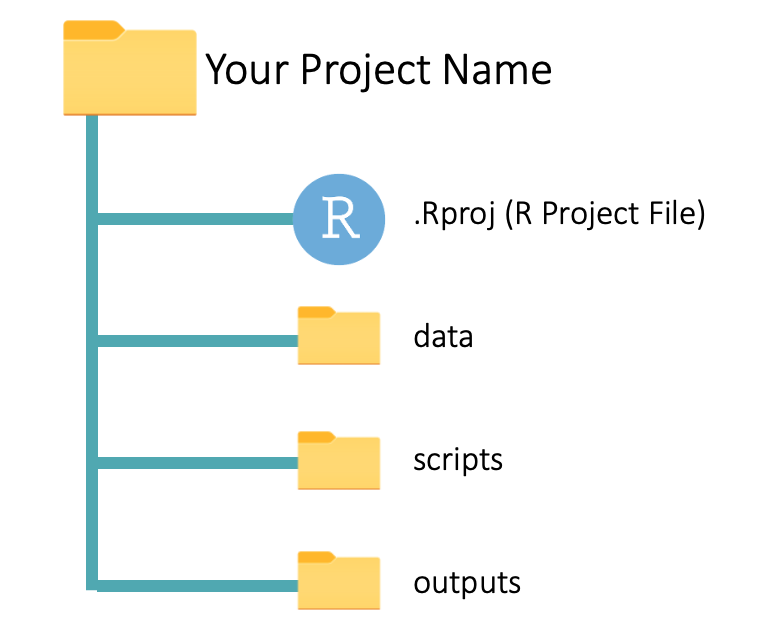{.absolute width="450" right="500" top="300"}
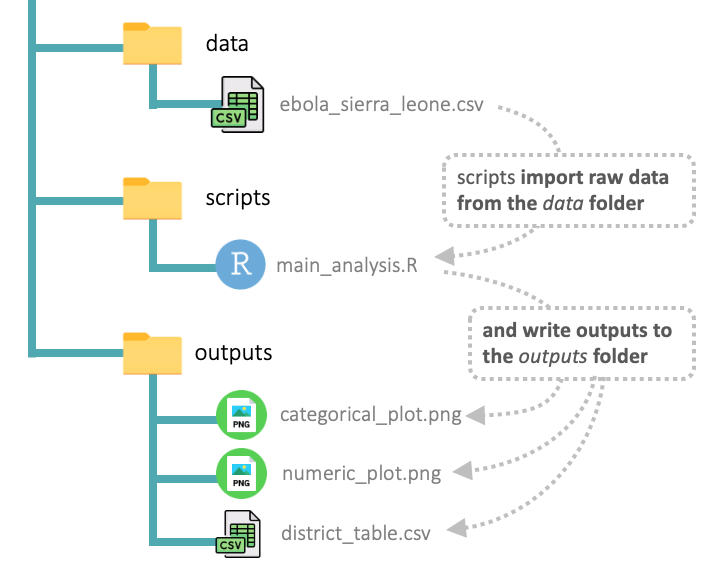{.absolute width="450" right="0" top="300"}

::: footer
[Foundations of data analysis with R](https://thegraphcourses.org/courses/r-foundations-beta/topics/rstudio-projects/)
:::

## Projeto R (.Rproj)

Criar um projeto no RStudio

<center>
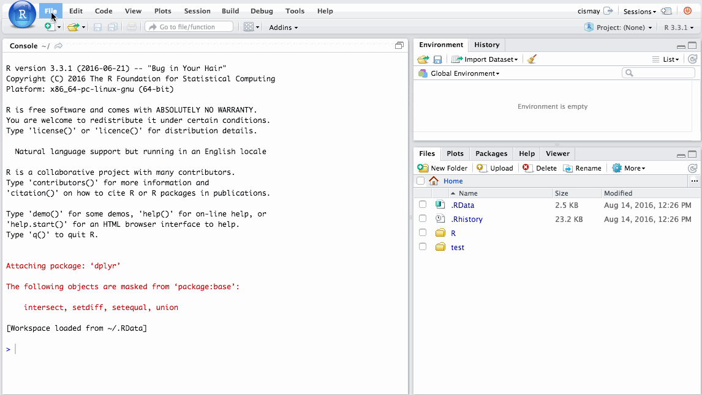
</center>

## Pseudocódigo

::: incremental
-   Forma de **representar** algoritmos, funções ou outros processos de forma simplificada e intuitiva

-   Escrito em **linguagem natural** e com elementos que se **assemelham** a uma linguagem de programação, mas não é realmente **executável**

-   Ferramenta para a **comunicação de ideias de programação**, permitindo que programadores de diferentes níveis de habilidade compreendam e colaborem de maneira eficiente
:::

## Pseudocódigo

::::: columns
::: {.column width="40%\""}
```{r eval=FALSE}
# pseudocodigo
0. pacotes
1. importar dados
2. limpar e ajustar dados
3. analises estatisticas
4. graficos
5. exportar resultados
```
:::

::: {.column width="70%\""}
```{r eval=FALSE}
# codigo

# 0. pacotes ----
library(tidyverse)
library(palmerpenguins)

# 1. importar dados ----
penguins <- penguins_raw
penguins

# 2. limpar e ajustar dados ----
penguins_clean <- na.omit(penguins)
penguins_clean

# 3. analises estatisticas ----
cor.test(penguins_clean$bill_length_mm, penguins_clean$bill_depth_mm)

# 4. graficos ----
plot(penguins_clean$bill_length_mm, penguins_clean$bill_depth_mm, pch = 20)

# 5. exportar resultados ----
png("grafico_penguins.png")
plot(penguins_clean$bill_length_mm, penguins_clean$bill_depth_mm, pch = 20)
dev.off()
```
:::
:::::

## Principais artigos de R e Ecologia

::: {style="font-size: 40%;"}

**Base R**

- [Ihaka, R., & Gentleman, R. (1996). R: A Language for Data Analysis and Graphics. Journal of Computational and Graphical Statistics, 5(3), 299.](https://doi.org/10.2307/1390807)
- [Wickham, H. (2011). R and S. Computational Statistics, 26(3), 395–404.](https://doi.org/10.1007/s00180-010-0205-5) 

**tidyverse**

- [Wickham, H. (2014). Tidy Data. Journal of Statistical Software, 59(10).](https://doi.org/10.18637/jss.v059.i10)
- [Wickham, H., … Yutani, H. (2019). Welcome to the Tidyverse. Journal of Open Source Software, 4(43), 1686.](https://doi.org/10.21105/joss.01686)

**R e Ecologia**

- [Gao, M., Ye, Y., Zheng, Y., & Lai, J. (2025). A comprehensive analysis of R’s application in ecological research from 2008 to 2023. Journal of Plant Ecology, 18(1), rtaf010.](https://doi.org/10.1093/jpe/rtaf010) 
- [Giorgi, F. M., Ceraolo, C., & Mercatelli, D. (2022). The R Language: An Engine for Bioinformatics and Data Science. Life, 12(5), Article 5.](https://doi.org/10.3390/life12050648)
- [Lai, J., Cui, D., Zhu, W., & Mao, L. (2023). The Use of R and R Packages in Biodiversity Conservation Research. Diversity, 15(12), Article 12.](https://doi.org/10.3390/d15121202)
- [Lai, J., Lortie, C. J., Muenchen, R. A., Yang, J., & Ma, K. (2019). Evaluating the popularity of R in ecology. Ecosphere, 10(1), e02567.](https://doi.org/10.1002/ecs2.2567)
- [Lortie, C. J., Braun, J., Filazzola, A., & Miguel, F. (2020). A checklist for choosing between R packages in ecology and evolution. Ecology and Evolution, 10(3), 1098–1105.](https://doi.org/10.1002/ece3.5970) 
- [Tippmann, S. (2015). Programming tools: Adventures with R. Nature, 517(7532), Article 7532.](https://doi.org/10.1038/517109a)

**Comunidade de usuários**

- [Bollmann, S. S., ... Debelak, R. (2017). A First Survey on the Diversity of the R Community. The R Journal, 9(2), Article 2.](https://doi.org/10.5167/uzh-233651)
- [Fox, J. (2009). Aspects of the Social Organization and Trajectory of the R Project. The R Journal, 1(2), 5–13.](https://doi.org/10.32614/RJ-2009-014)
- [Mair, P., ... Hornik, K. (2015). Motivation, values, and work design as drivers of participation in the R open source project for statistical computing. Proceedings of the National Academy of Sciences, 112(48), 14788–14792.](https://doi.org/10.1073/pnas.1506047112)
:::

# Dúvidas?

## IMPORTANTE 2!!!

**Duas formas de ensino de R**

<br><br><br>

1. Alunos digitando em tempo real e criando um script

2. Alunos executando o script já fornecido

::: footer
[Vancine et al. (2026)](https://revistas.ufrj.br/index.php/oa/article/view/64848)
:::

## IMPORTANTE 2!!!

**Duas formas de ensino de R**

<br><br><br>

1. Alunos digitando em tempo real e criando um script

**2. Alunos executando o script já fornecido**

::: footer
[Vancine et al. (2026)](https://revistas.ufrj.br/index.php/oa/article/view/64848)
:::

## Repositório do GitHub

<br>

[https://github.com/mauriciovancine/course-intro-r-unicamp](https://github.com/mauriciovancine/course-intro-r-unicamp)

<br>

<center>

</center>

::: footer
[course-intro-r-unicamp](https://github.com/mauriciovancine/course-intro-r-unicamp)
:::

## Script

Abram o script:

<br><br><br><br>

`02_script_r.R`

# Atributos de objetos

## Modo dos objetos (*mode*)

A natureza dos elementos definirá os modos dos objetos

::::: columns
::: {.column width="50%"}
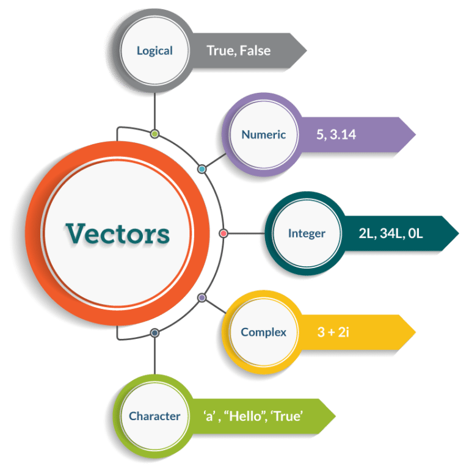
:::

::: {.column width="50%"}
```{r}
logical <- TRUE
logical

numeric <- 3.14
numeric

integer <- 2L
integer

complex <- 3 + 2i
complex

character <- "a"
character
```
:::
:::::

## Modo dos objetos (*mode*)

Verificar e mudar a natureza dos modos dos objetos

::::: columns
::: {.column width="50%"}

:::

::: {.column width="50%"}
```{r eval=FALSE}
## verificar o modo dos objetos
is.logical()
is.numeric()
is.integer()
is.complex()
is.character()

## conversoes entre modos
as.logical()
as.numeric()
as.integer()
as.complex()
as.character()
```
:::
:::::

## Estrutura dos objetos (*class*)

Organização dos elementos dos objetos

<center>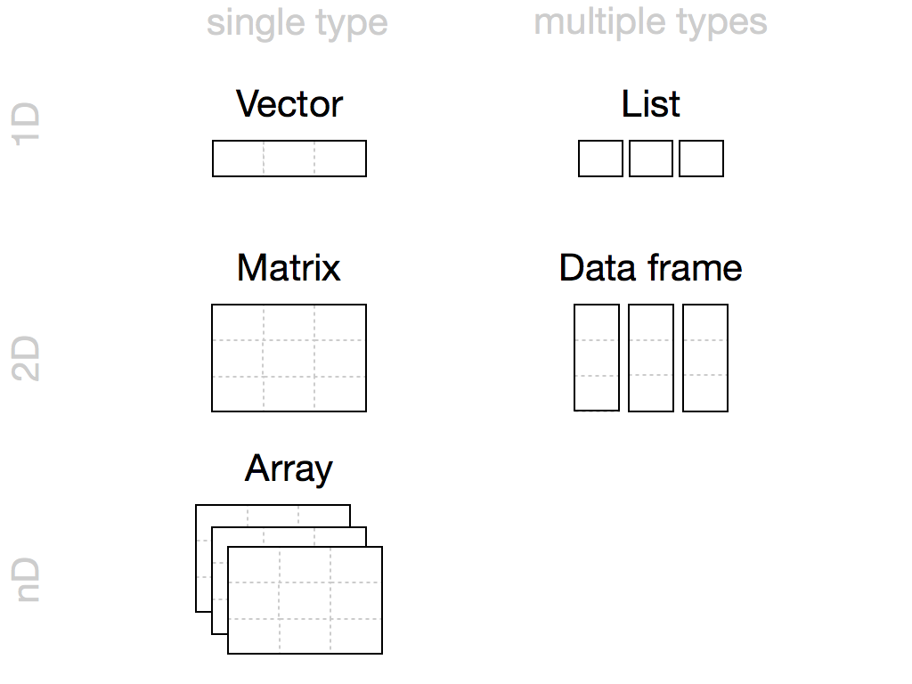</center>

## Estrutura dos objetos (*class*) {.smaller}

**Vector**

Sequência de valores que representam uma variável contínua ou descrição textual

::::: columns
::: {.column width="50%"}
<br><br> 
:::

::: {.column width="50%"}
```{r}
# concatenar
c(1, 2, 3)
c("amostra1", "amostra2", "amostra3")

# sequencia
seq(1, 10, 2)

# repetir
rep(c(23, 42), times = 2)
rep(c(23, 42), each = 2)

# combinar
paste("amostra", 1:3)

# amostrar
sample(1:60, 6)
```
:::
:::::

## Estrutura dos objetos (*class*) {.smaller}

**Factor**

Sequência de valores que representam uma variável categórica (níveis)

::::: columns
::: {.column width="50%"}
<br><br> 
:::

::: {.column width="50%"}
```{r}
# factor nominal
ftc_nom <- factor(
  x = sample(c("f", "p"), size = 20, rep = TRUE),
  levels = c("f", "p"))
ftc_nom
levels(ftc_nom)

# factor ordinal
ftc_ord <- factor(
  x = sample(c("b", "a"), size = 20, rep = TRUE),
  levels = c("b", "a"), ordered = TRUE)
ftc_ord
levels(ftc_ord)
```
:::
:::::

## Estrutura dos objetos (*class*) {.smaller}

**Matrix**

Representa os dados no formato de tabela, com linhas (locais) e colunas (variáveis)

::::: columns
::: {.column width="50%"}
<br><br> 
:::

::: {.column width="50%"}
```{r}
# dispor uma sequencia
ve <- 1:9
ma_col <- matrix(data = ve, nrow = 3, 
                 ncol = 3, byrow = FALSE)
ma_col

# combinar vetores
vec_1 <- c(1, 2, 3)
vec_2 <- c(4, 5, 6)

ma_rbind <- rbind(vec_1, vec_2)
ma_rbind

ma_cbind <- cbind(vec_1, vec_2)
ma_cbind
```
:::
:::::

## Estrutura dos objetos (*class*) {.smaller}

**Array**

Combinação de tabelas, com linhas (locais), colunas (variáveis) e dimensões (tempo)

::::: columns
::: {.column width="50%"}
<br><br> 
:::

::: {.column width="50%"}
```{r}
# dispor uma sequencia
ve <- sample(c(0, 1), 27, rep = TRUE)
ar <- array(data = ve, dim = c(3, 3, 3))
ar
```
:::
:::::

## Estrutura dos objetos (*class*) {.smaller}

**List**

Tipo especial de vetor que aceita objetos como elementos

::::: columns
::: {.column width="50%"}
<br><br> 
:::

::: {.column width="50%"}
```{r}
# concatenar objetos
li <- list(ve, # vector
           ma_rbind, # matrix
           ma_cbind) # outra matrix
li
```
:::
:::::

## Estrutura dos objetos (*class*) {.smaller}

**Data frame**

Representa os dados no formato de tabela, com linhas e colunas, mas misturando modos

::::: columns
::: {.column width="50%"}
<br><br> 
:::

::: {.column width="50%"}
```{r}
# combinando vetores horizontalmente
sp <- c("sp1", "sp2", "sp3")
ab <- c(12, 8, 9)
ha <- c("flo", "cer", "past")

df <- data.frame(sp, ab, ha)
df
```

```{r}
# combinando vetores horizontalmente com nomes
df <- data.frame(
  especies = paste0("sp", 1:3), 
  abundancia = sample(5:10, 3), 
  vegetacao = c("flo", "cer", "past")
)
df
```
:::
:::::

# Manejo de dados (1D)

## Vetor e Fator

**1. Indexação []**: acessa elementos de vetores e fatores

```{r}
# indexacao []

# fixar a amostragem - a amostragem apos isso sera igual
set.seed(42)

# amostrar 10 elementos de uma sequencia
ve <- sample(x = seq(0, 2, .05), size = 10)
ve
```

## Vetor e Fator

**1. Indexação []**: acessa elementos de vetores e fatores

Selecionar elementos
```{r}
# seleciona o quinto elemento
ve[5]
```

<br>

```{r}
# seleciona os elementos de 1 a 5
ve[1:5] 
```

<br>

```{r}
# seleciona os elementos 1 e 10 e atribui
ve_sel <- ve[c(1, 10)]
ve_sel
```

## Vetor e Fator

**1. Indexação []**: acessa elementos de vetores e fatores

Retirar elementos
```{r}
# retira o decimo elemento
ve[-10]
```

<br>

```{r}
# retira os elementos 2 a 9
ve[-(2:9)]
```

<br>

```{r}
# retira os elementos 5 e 10 e atribui
ve_sub <- ve[-c(5, 10)]
ve_sub
```

## Vetor e Fator

**2. Seleção condicional**: selecionar elementos por condições 

```{r}
# dois vetores
foo <- 42
bar <- 23
```

<br>

```{r eval=FALSE}
# operadores relacionais - saidas booleanas (TRUE ou FALSE)
foo == bar # igualdade
foo != bar # diferenca 
foo > bar # maior
foo >= bar # maior ou igual
foo < bar # menor
foo <= bar # menor ou igual
```

## Vetor e Fator

**2. Seleção condicional**: selecionar elementos por condições 

```{r}
# quais valores sao maiores que 1?
ve > 1
```

<br>

```{r}
# valores acima de 1
ve[ve > 1] 
```

<br>

```{r}
# atribuir valores maiores que 1
ve_maior1 <- ve[ve > 1]
ve_maior1
```

## Vetor e Fator

**3. Funções de manejo**: `max()`, `min()`, `range()`, `length()`, `sort()` e `round()`

```{r}
# maximo
max(ve)
```

<br>

```{r}
# minimo
min(ve)
```

## Vetor e Fator

**3. Funções de manejo**: `max()`, `min()`, `range()`, `length()`, `sort()` e `round()`

```{r}
# amplitude
range(ve)
```

<br>

```{r}
# comprimento
length(ve)
```

## Vetor e Fator

**3. Funções de manejo**: `max()`, `min()`, `range()`, `length()`, `sort()` e `round()`

```{r}
# ordenar crescente
sort(ve)
```

<br>

```{r}
# ordenar decrescente
sort(ve, dec = TRUE)
```

## Vetor e Fator

**3. Funções de manejo**: `max()`, `min()`, `range()`, `length()`, `sort()` e `round()`

```{r}
# arredondamento
ve
```

<br>

```{r}
# arredondamento
round(ve, digits = 1)
```

<br>

```{r}
# arredondamento
round(ve, digits = 0)
```

## Vetor e Fator

**3. Funções de manejo**: `any()`, `all()` e `which()`

```{r}
# algum?
any(ve > 1)
```

<br>

```{r}
# todos?
all(ve > 1)
```

<br>

```{r}
# qual(is)?
which(ve > 1)
```

## Vetor e Fator

**3. Funções de manejo**: `subset()` e `ifelse()`

```{r}
# subconjunto
subset(ve, ve > 1)
```

<br>

```{r}
# condicao para uma operacao
ifelse(ve > 1, 1, 0)
```

## Listas

**1. Indexação []**: acessa elementos de listas

```{r}
## indexacao []
# lista
li <- list(elem1 = 1, elem2 = 2, elem3 = 3)
li
```

## Listas

**1. Indexação []**: acessa elementos de listas

Selecionar elementos
```{r}
# acessar o primeiro elemento
li[1]
```

<br>

```{r}
# acessar o primeiro e o terceiro elementos e atribuir
li2 <- li[c(1, 3)]
li2
```

## Listas

**1. Indexação []**: acessa elementos de listas

Retirar elementos

```{r}
# retirar o primeiro elemento
li[-1]
```

<br>

```{r}
# retirar o segundo elemento e atribuir
li_13 <- li[-2]
li_13
```

## Listas

**2. Indexação [[]]**: acessa valores dos elementos de listas

Retirar elementos
```{r}
# valor do primeiro elemento
li[[1]]
```

<br>

```{r}
# valor do segundo elemento e atribuir
li2_val <- li[[2]]
li2_val
```

## Listas

**3. Indexação $**: acessa elementos pelo nome

Selecionar elementos pelo nome

```{r}
# acessar o primeiro elemento
li$elem1
```

<br>

```{r}
# acessar o primeiro e o terceiro elementos e atribuir
li1 <- li$elem1
li1
```

## Listas

**4. Funções**: `length()` e `names()`

```{r}
# comprimento
length(li)
```

<br>

```{r}
# names
names(li)
```

## Listas

**4. Funções**: `length()` e `names()`

```{r}
# renomear
names(li) <- paste0("elemento0", 1:3)
li
```

# Manejo de dados (2D ou nD)

## Matrizes, Arrays e Data Frames

**1. Indexação []**: acessa elementos de matrizes, arrays e data frames

```{r}
# matriz
ma <- matrix(1:12, 4, 3)
ma 
```

## Matrizes, Arrays e Data Frames

**1. Indexação []**: acessa elementos de matrizes, arrays e data frames

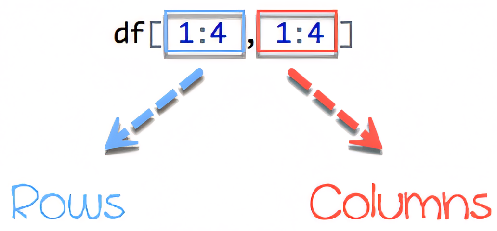{fig-align="center"}

## Matrizes, Arrays e Data Frames

**1. Indexação []**: acessa elementos de matrizes, arrays e data frames

```{r}
# linha 3
ma[3, ]
```

<br>

```{r}
# coluna 2
ma[, 2] 
```

<br>

```{r}
# elemento da linha 1 e coluna 2
ma[1, 2] 
```

<br>

```{r}
# elementos da linha 1 e coluna 1 e 2
ma[1, 1:2] 
```

## Matrizes, Arrays e Data Frames

**1. Indexação []**: acessa elementos de matrizes, arrays e data frames

```{r}
# elementos da linha 1 e coluna 1 e 3
ma[1, c(1, 3)] 
```

<br>

```{r}
# elementos da linha 1 e coluna 1 e 3 e atribuir
ma_sel <- ma[1, c(1, 3)]
ma_sel
```

## Matrizes, Arrays e Data Frames

**1. Indexação []**: acessa elementos de matrizes, arrays e data frames

<center>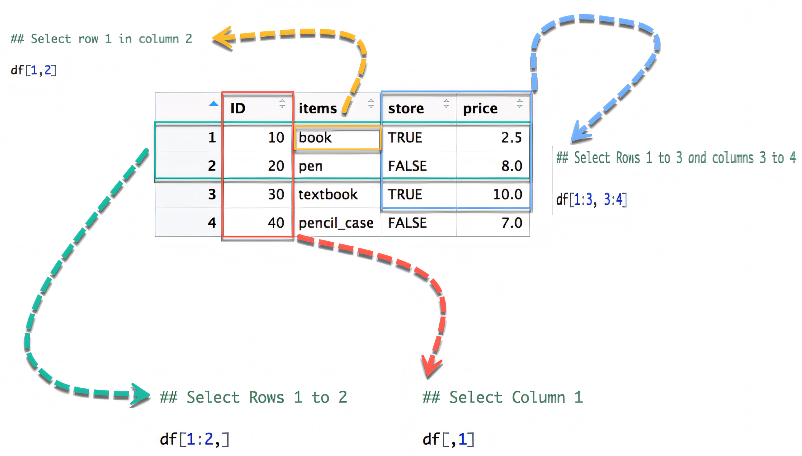</center>

## Data Frames

**2. Indexação $**: acessa elementos de data frames

```{r}
# criar tres vetores
sp <- paste("sp", 1:10, sep = "")
abu <- 1:10
flo <- factor(rep(c("campo", "floresta"), each = 5))
```

<br>

```{r}
# data frame
df <- data.frame(sp, abu, flo)
df
```

## Data Frames

**2. Indexação $**: acessa colunas de data frames

```{r}
# $ funciona apenas para data frame 
df$sp 
```

<br>

```{r}
df$abu
```

<br>

```{r}
df$flo
```

## Data Frames

**2. Indexação $**: acessa colunas de data frames pelo nome

```{r}
# funcoes para uma coluna indexada por $
length(df$abu)
max(df$abu)
min(df$abu)
range(df$abu)
```

## Data Frames

**3. Indexação $ e mudanças de colunas**: acessa e modifica colunas em data frames

```{r}
# modo
mode(df$abu)
```

<br>

```{r}
# converter colunas para caracter
df$abu <- as.character(df$abu)
```

<br>

```{r}
# modo
df$abu
mode(df$abu)
```

## Data Frames

**3. Indexação $ e mudanças de colunas**: acessa e modifica colunas em data frames

```{r}
# converter colunas para numerico
df$abu <- as.numeric(df$abu)
```

<br>

```{r}
# modo
df$abu
mode(df$abu)
```

## Data Frames

**4. Indexação $ e adicionar colunas**: acessa e adiciona colunas em data frames

```{r}
# adicionar coluna
set.seed(42)
df$abu2 <- sample(0:1, nrow(df), rep = TRUE)
```

<br>

```{r}
df$abu2
```

<br>

```{r}
df
```

## Data Frames

**5. Seleção condicional**: filtro de linhas

Selecionar linhas = filtro da planilha eletrônica

```{r}
# selecionar linhas de uma matriz ou data frame 
df[df$abu > 4, ]
```

## Data Frames

**5. Seleção condicional**: filtro de linhas

Selecionar linhas = filtro da planilha eletrônica

```{r}
# selecionar linhas de uma matriz ou data frame 
df[df$abu2 == 0, ]
```

## Data Frames

**5. Seleção condicional**: filtro de linhas

Selecionar linhas = filtro da planilha eletrônica

```{r}
# selecionar linhas de uma matriz ou data frame 
df[df$flo == "floresta", ]
```

## Matrizes, Arrays e Data Frames

**6. Funções de conferência e manejo**

<br>

::: {style="font-size: 70%;"}
`head()`: primeiras 6 linhas\
`tail()`: últimas 6 linhas\
`nrow()`: número de linhas\
`ncol()`: número de colunas\
`dim()`: número de linhas e de colunas\
`rownames()`: nomes das linhas (locais)\
`colnames()`: nomes das colunas (variáveis)\
`str()`: classes de cada coluna (estrutura)\
`summary()`: resumo dos valores de cada coluna\
`rowSums()`: soma das linhas (horizontal)\
`colSums()`: soma das colunas (vertical)\
`rowMeans()`: média das linhas (horizontal)\
`colMeans()`: média das colunas (vertical)
:::

# Valores faltantes e especiais

## Valores faltantes e especiais

São **valores reservados** que representam *dados faltantes*, *indefinições matemáticas*, *infinitos* e *objetos nulos*

<br>

**1. NA (Not Available)**\
**2. NaN (Not a Number)**\
**3. Inf (Infinito)**\
**4. NULL**

<br>

> Nenhum deles é entre aspas!

## Valores faltantes e especiais

**1. NA (Not Available)**

- Significa dado faltante/indisponível
- **NA** deve ser maiúsculo

```{r}
# na - not available
foo_na <- NA
foo_na
```

## Valores faltantes e especiais

**1. NA (Not Available)**

Criar um data frame com NA

```{r}
# data frame
df <- data.frame(var1 = c(1, 4, 2, NA), var2 = c(1, 4, 5, 2))
df
```

## Valores faltantes e especiais

**1. NA (Not Available)**

Função para verificar a **presença/ausência** de NA's

```{r}
# possui nas?
is.na(df)
```

Função para verificar a **presença de algum** NA's

```{r}
# algum é na?
any(is.na(df))
```

## Valores faltantes e especiais

**1. NA (Not Available)**

Vamos retirar as linhas que possuem NA's

```{r}
# retirar linhas com na
df_sem_na <- na.omit(df)
df_sem_na
```

<br>

```{r}
# numero de linhas com e sem na
nrow(df)
nrow(df_sem_na)
```

## Valores faltantes e especiais

**1. NA (Not Available)**

Vamos substituir os NA's por 0

```{r}
# substituir na por 0
df[is.na(df)] <- 0
df
```

## Valores faltantes e especiais

**2. NaN (Not a Number)**

Representa indefinições matemáticas como 0/0 e log(-1)

```{r}
# nan - not a number
0/0

# nan - not a number
log(-1)
```

## Valores faltantes e especiais

**2. NaN (Not a Number)**

Um **NaN** é um **NA**, mas o **NA** não é um **NaN**

```{r}
# criar um vetor
ve <- c(1, 2, 3, NA, NaN)
ve
```

<br>

```{r}
# verificar a presenca de na
is.na(ve)
```

<br>

```{r}
# verificar a presenca de nan
is.nan(ve)
```

## Valores faltantes e especiais

**3. Inf (Infinito)**

É um número muito grande ou um limite matemático, e.g., 10^310 e 1/0

```{r}
# limite matematico
1/0

# numero muito grande
10^310
```

## Valores faltantes e especiais

**4. NULL**

Representa um objeto nulo

Útil para preenchimento de laços e outras aplicações de programação

```{r}
# objeto nulo
nulo <- NULL
nulo
```

## Tabelas

### Matrizes e planilhas eletrônicas

Já notaram a relação entre matrizes (escola) e planilhas eletrônicas (Excel®)?

<center>

</center>

::: footer
[Gemini](https://gemini.google.com/app/ea652cffead725f9)
:::

## Tabelas

### Formato

- **Wide (largo)**: valores **não repetem** na primeira coluna
- **Long (longo)**: valores **repetem** na primeira coluna

<center>
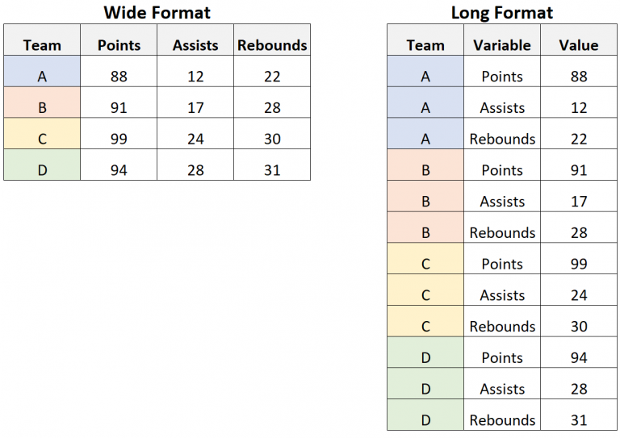
</center>

::: footer
[Long vs. Wide Data: What’s the Difference?](https://www.statology.org/long-vs-wide-data/)
:::

## Tabelas

### Armazenar dados

- **Dados primários**: dados coletados de campo ou laboratório
- **Dados secundários**: dados organizados de outros trabalhos
- **Dados brutos (raw data)**: dados imutáveis

<center>
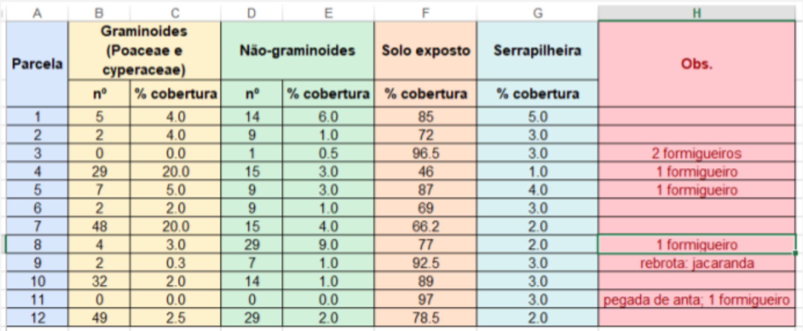
</center>

::: footer
[Long vs. Wide Data: What’s the Difference?](https://www.statology.org/long-vs-wide-data/)
:::

## Tabelas {.smaller}

### Dados no R

::::: columns
::: {.column width="40%"}
<center>
<br><br>
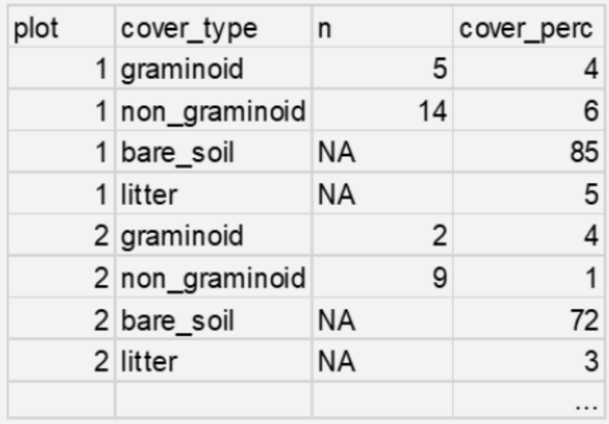
</center>
:::

::: {.column width="60%"}
- Cabeçalho claro e informativo
- Categorias na mesma coluna
- Nomes curtos e sem caracteres especiais (inglês)
- Use ‘_’ para espaços
- Comece com letras (evite números e espaços)
- Use apenas letras minúsculas
- Nomes curtos
- Células em branco ou NA 
- (NA = not available)
- Ponto como separador decimal
:::
:::::

## Tabelas {.smaller}

### Tipos de arquivos

**.txt e .csv**

- Arquivos de texto simples, i.e., abrem em qualquer editor de texto
- *Text File* (.txt) e *Comma-Separated Values* (.csv) 
- Armazanados com mais segurança, sem depender de formato específico
- Funções base para importar (`read.table`, `read.csv`)

<center>
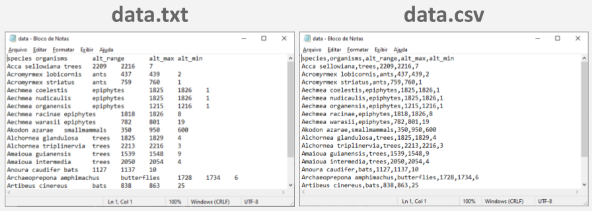
</center>

## Tabelas {.smaller}

### Tipos de arquivos

**.xlsx**

- Microsoft Excel’s workbook (pastas) 
- Arquivo compactado contendo várias pastas e arquivos XML que descrevem o conteúdo da planilha (dados, estilos, formatações, etc.)
- Formato fechado, estão sujeito a dependências de software
- Pacotes específicos para importação no R (`readxl`)

<center>
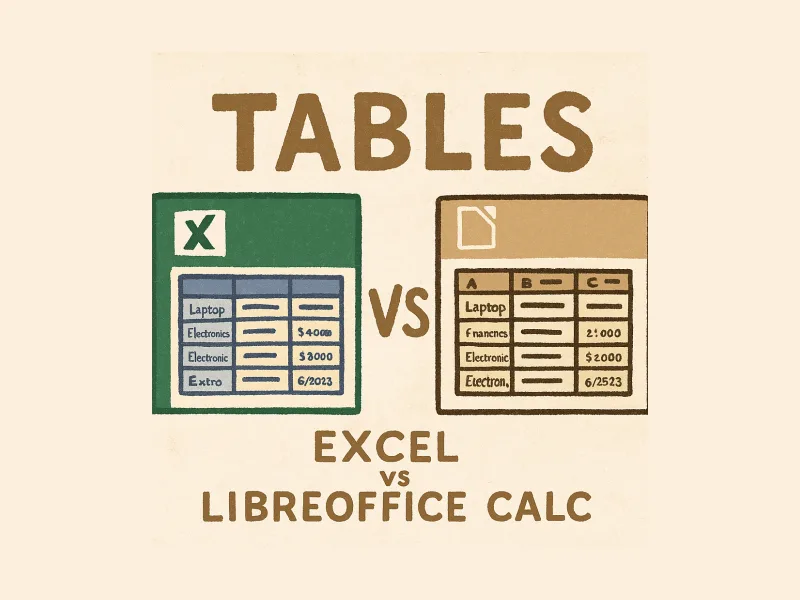
</center>

## Tabelas {.smaller}

### Tipos de arquivos

**.ods**

- Libreoffice - Calc
- Formato aberto, não estão sujeito a dependências de software
- Pacotes específicos para importação no R (`readODS`)

<center>
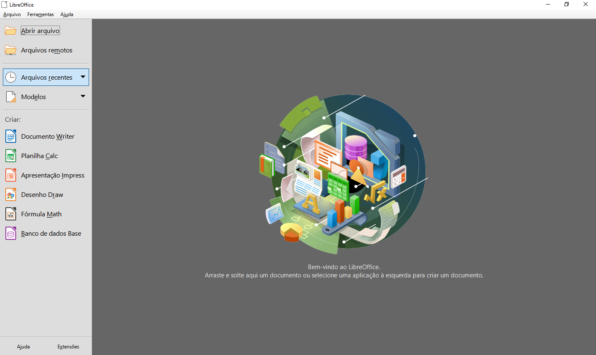
</center>

::: footer
[LibreOffice](https://libreoffice.org)
:::

## Tabelas

### Evite transtornos

- Evite usar vírgula como decimal - confusão com .csv
- Mude a configuração do computador (Excel®, Google Sheets…)
- Cuidado com caracteres especiais (e.g. ’ | “ | ’ | ` | ~)
- Há outros tipos de arquivos e formatos
- Se possível, estude banco de dados (e.g. SQL e NoSQL)

# Diretório de trabalho

## Diretório de trabalho (*Work directory*)

Endereço da pasta onde o R irá **importar e exportar** os dados

- **Atalho**: `ctrl + shift + H`
- **Windows: inverter as barras (\\ por /)!**
- **Work directory**: `wd`


```{r eval=FALSE}
# definir o diretorio de trabalho
setwd("/home/mude/data/github/course-intror/data")
```

**Conferir diretório**

```{r eval=FALSE}
# conferir diretorio
getwd()

# listar arquivos
dir()
```

# Vamos trabalhar com dados reais?

#

<center>
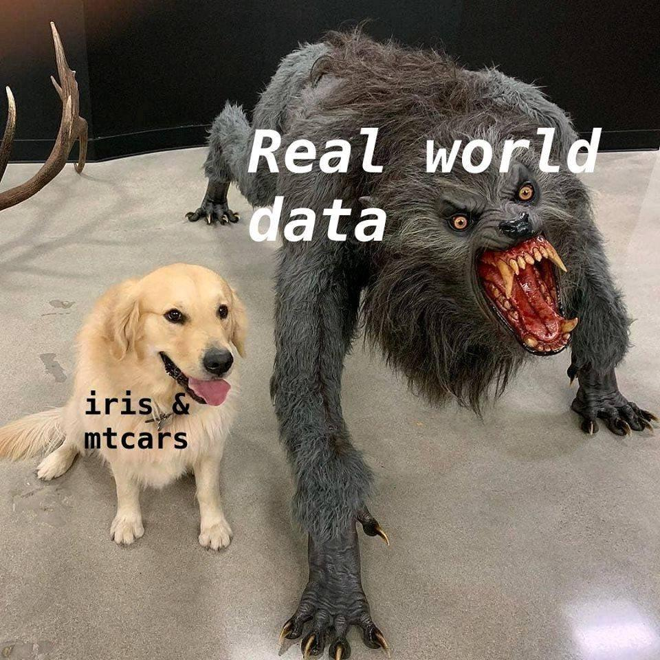
</center>

## Importar dados

ATLANTIC AMPHIBIANS: a dataset of amphibian communities from the Atlantic Forests of South America

<center>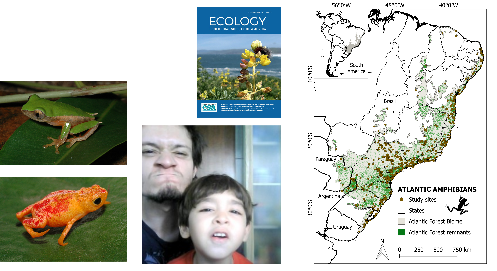</center>

::: footer
[Vancine et al. (2018)](https://doi.org/10.1002/ecy.2392)
:::

## Importar dados

### Argumentos importantes

**1. sep**
```{r eval=FALSE}
read.table(sep = "\t") # tabulacao - espaco maior do TAB
read.table(sep = ",") # virgula
read.table(sep = ";") # ponto e virgula
```

**2. dec**
```{r eval=FALSE}
read.csv(dec = ".") # decimal - ponto
```

**3. header**
```{r eval=FALSE}
read.csv(header = TRUE) # primeira linha como cabecalho
```

**4. encoding**
```{r eval=FALSE}
read.table(encoding = "Latin-1") # caracteres especiais
read.table(encoding = "UTF-8") # caracteres especiais
```

## Importar dados

Ler uma planilha eletrônica (.csv)

```{r eval=FALSE}
# ler uma planilha eletronica (.csv)
read.csv("ATLANTIC_AMPHIBIANS_sites.csv", encoding = "latin1")
```

```{r echo=FALSE}
read.csv("data/ATLANTIC_AMPHIBIANS_sites.csv", encoding = "latin1")
```

## Importar dados

Ler e atribuir uma planilha eletrônica (.csv) a um objeto

```{r echo=FALSE}
da <- read.csv("data/ATLANTIC_AMPHIBIANS_sites.csv", encoding = "latin1")
```

```{r eval=FALSE}
# ler e atribuir uma planilha eletronica (.csv) a um objeto
da <- read.csv("ATLANTIC_AMPHIBIANS_sites.csv", encoding = "latin1")
```

```{r eval=FALSE}
# ver os dados
da
```

<br>

```{r}
# conferir a classe
class(da)
```

# IMPORTANTE: uma tabela importada para o R sempre será um **data frame**!

## Importar dados

Ler e atribuir uma planilha simples (.txt) a um objeto

```{r eval=FALSE}
# ler e atribuir uma planilha simples (.txt) a um objeto
da <- read.table("ATLANTIC_AMPHIBIANS_sites.txt", header = TRUE, sep = "\t")
da
```

```{r echo=FALSE}
da
```

## Importar dados

Ler e atribuir uma planilha eletrônica (.xlsx) a um objeto

Pacote **openxlsx**
```{r eval=FALSE}
# pacote openxlsx
# install.packages("openxlsx")
library(openxlsx)
```

<br>

```{r eval=FALSE}
# ler e atribuir uma planilha eletrônica (.xlsx) a um objeto
da <- openxlsx::read.xlsx("ATLANTIC_AMPHIBIANS_sites.xlsx", sheet = 1, encoding = "latin1")
da
```

```{r echo=FALSE}
da
```

# Conferência de dados importados

## Conferência de dados importados

Conjunto de funções para conferir os dados

<br>

**Funções de conferência**

::: {style="font-size: 80%;"}
`head()`: primeiras 6 linhas<br>
`tail()`: últimas 6 linhas<br>
`nrow()`: número de linhas<br>
`ncol()`: número de colunas<br>
`dim()`: número de linhas e de colunas<br>
`rownames()`: nomes das linhas (locais)<br>
`colnames()`: nomes das colunas (variáveis)<br>
`str()`: classes de cada coluna (estrutura)<br>
`summary()`: resumo dos valores de cada coluna
:::

## Conferência de dados importados

`head()`: mostra as primeiras 6 linhas

```{r include=FALSE}
# ler e atribuir uma planilha eletronica (.csv) a um objeto
da <- read.csv("data/ATLANTIC_AMPHIBIANS_sites.csv", encoding = "latin1")
```

<br>

```{r}
# primeiras linhas
head(da)
```

## Conferência de dados importados

`head()`: mostra as primeiras 10 linhas

```{r}
# primeiras linhas
head(da, 10)
```

## Conferência de dados importados

`tail()`: mostra as últimas 6 linhas

```{r}
# ultimas linhas
tail(da)
```

## Conferência de dados importados

`nrow()`: mostra o número de linhas

```{r}
# numero de linhas
nrow(da)
```

`ncol()`: mostra o número de colunas

```{r}
# numero de colunas
ncol(da)
```

`dim()`: mostra o número de linhas e de colunas

```{r}
# numero de linhas e de colunas
dim(da)
```

## Conferência de dados importados

`rownames()`: mostra os nomes das linhas (locais)

```{r}
# nome das linhas
rownames(da)
```

## Conferência de dados importados

`colnames()`: mostra os nomes das colunas (variáveis)

```{r}
# nome das colunas
colnames(da)
```

## Conferência de dados importados

`str()`: mostra as classes de cada coluna (estrutura)

```{r}
# estrutura dos dados
str(da)
```

## Conferência de dados importados

`summary()`: mostra um resumo dos valores de cada coluna

```{r}
# resumo dos dados
summary(da)
```

## Conferência de dados importados

Verificar a presença de NAs

```{r}
# algum nas?
any(is.na(da))
```

<br>

```{r}
# quais sao nas?
which(is.na(da))
```

## Conferência de dados importados

Retirar os NAs

```{r}
# omitir as linhas com nas e atribuir 
da_na <- na.omit(da)
```

<br>

```{r}
# numero de linhas do dado total
nrow(da)
```

<br>

```{r}
# numero de linhas do dado sem nas
nrow(da_na)
```

## Conferência de dados importados

Subset das linhas

```{r}
# subset das linhas com amostragens em sao paulo
da_sp <- da[da$state == "São Paulo", ]
da_sp
```

# Exportar dados

## Exportar dados

Exportar uma tabela de dados na pasta do diretório

1. csv (*Comma Separated Values*)

```{r eval=FALSE}
# exportar csv
write.csv(da_sp, "ATLANTIC_AMPHIBIAN_sites_sao_paulo.csv", 
          row.names = FALSE, quote = FALSE)
```

2. txt (*Text File*)

```{r eval=FALSE}
# exportar txt
write.table(da_sp, "ATLANTIC_AMPHIBIAN_sites_sao_paulo.txt", 
            row.names = FALSE, quote = FALSE)
```

## Exportar dados

Exportar uma tabela de dados na pasta do diretório

3. xlsx (*Excel Spreadsheet XML*)

```{r, eval = FALSE, warning = FALSE}
# exportar xlsx
openxlsx::write.xlsx(da_sp, "ATLANTIC_AMPHIBIAN_sites_sao_paulo.xlsx", 
                     row.names = FALSE, quote = FALSE)
```

## Outros pacotes para aprofundar

Recomendo explorar outros pacotes

- [data.table](https://rdatatable.gitlab.io/data.table/): big data 
- [vroom](https://vroom.r-lib.org/): big data
- [qs/qs2](https://github.com/qsbase/qs2): big data
- [arrow](https://arrow.apache.org/): big data e banco de dados
- [duckdb](https://duckdb.org/docs/api/r.html): big data e banco de dados
- [DBI](https://dbi.r-dbi.org/): banco de dados
- [haven](https://haven.tidyverse.org/): formatos de outros softwares (SPSS, SAS, Stata)
- [foreign](https://cran.r-project.org/package=foreign): formatos de outros softwares (SPSS, SAS, Stata)

## Leitura

**Big Data no R**

- Dados são alocados na memória RAM
- Como importar uma tabela maior que a memória RAM?

<center>

</center>

::: footer
[Big Data no R: como ler um conjunto de dados maior que a RAM](https://mauriciovancine.github.io/blog/r-big-data)
:::

# Dúvidas?

## Muito obrigado!

::::: columns
::: {.column width="50%"}
Agradecimentos:

- [Prof. Tadeu Siqueira](https://tsiqueiralab.weebly.com/)
- [Prof. Miltinho](https://leec.eco.br/)
- [Cleber Chaves]()

{.absolute width=40% right=650 top=450}
:::

::: {.column width="50%"}
Contato:

<center>
[mauricio.vancine\@gmail.com]() [mauriciovancine.github.io](mauriciovancine.github.io)

</center>
:::
:::::

::: footer
Slides por [Maurício Vancine](https://mauriciovancine.github.io/), feitos com [Quarto](https://quarto.org/). Código disponível no [GitHub](https://github.com/mauriciovancine/workshop-r-introduction/blob/master/01_slides/slides.qmd).
:::