```{r setup, include=FALSE}
library(palmerpenguins)
penguins_sem_na <- na.omit(penguins)
```

## Conteúdo

::: panel-tabset
## Explorar dados
- Dados brutos
- Observações e variáveis
- Tabelas de frequência
- Frequência absoluta e relativa
- Função: `table`
- Medidas de posição e dispersão
- Funções: `apply`, `lapply`, `sapply`, `tapply`...

## Programação
- Controle de fluxo
- Condicional: `if`, `else` e `else if`
- Estruturas de repetição
- Laços: `for`, `while` e `repeat`
- Comandos: `break` e `next`
- Funções
- Funções externas: `source`
:::

## Repositório do GitHub

<br>

[https://github.com/mauriciovancine/course-intro-r-unicamp](https://github.com/mauriciovancine/course-intro-r-unicamp)

<br>

<center>

</center>

::: footer
[course-intro-r-unicamp](https://github.com/mauriciovancine/course-intro-r-unicamp)
:::

## Script

Abram o script:

<br><br><br><br>

`04_script_r.R`

## Para apresentar os próximos conceitos e funções, vamos usar dados de pinguins

<center>

</center>

::: footer
[palmerpenguins](https://allisonhorst.github.io/palmerpenguins/)
:::

## palmerpenguins {.smaller}

-   Dados de medidas de pinguins chamados `palmerpenguins`
-   Dados coletados e disponibilizados pela [Dra. Kristen Gorman](https://www.uaf.edu/cfos/people/faculty/detail/kristen-gorman.php) e pela [Palmer Station, Antarctica LTER](https://pal.lternet.edu/), membro da [Long Term Ecological Research Network](https://lternet.edu/)
-   Dois conjuntos de dados:
- `penguins_raw` (dados brutos)
- `penguins` (versão simplificada)

{.absolute width="700" height="400" right="-50" top="300"}

::: footer
[palmerpenguins](https://allisonhorst.github.io/palmerpenguins/)
:::

## palmerpenguins

```{r eval=FALSE}
# instalar 
install.packages("palmerpenguins")

# carregar
library(palmerpenguins)

# ajuda dos dados
?penguins
?penguins_raw

# remover nas
penguins_sem_na <- na.omit(penguins)
```

```{r echo=FALSE}
library(palmerpenguins)
```

{.absolute width="430" right="-30" top="400"}

::: footer
[palmerpenguins](https://allisonhorst.github.io/palmerpenguins/)
:::

# Análise exploratória de dados (AED)

## Dados brutos

- `palmerpenguins`

```{r}
head(penguins_sem_na, n = 10)
```

## Observações e variáveis

- Cada linha dos dados é uma **observação**
- Cada coluna dos dados é uma **variável**

```{r}
head(penguins_sem_na, n = 10)
```

## Tabela de frequência {.smaller}

<br>

-   **Dados brutos**: conjunto dos valores numéricos coletados na pesquisa

-   **Classes**: intervalo de valores contínuos (0 \|--- 1)

-   **Frequência absoluta (fi)**: número de vezes que uma observação aparece ou pertencente a um intervalo ou classe

-   **Frequência total**: soma de todas as frequências absolutas (fi)

-   **Frequência relativa (fri)**: valor da razão de cada frequência absoluta (fi) com a frequência total (somatório de fi)

-   **Frequência acumulada (Fi)**: obtida somando (acumulando) os valores da frequência absoluta (fi)

-   **Frequência relativa acumulada (Fri)**: obtida somando (acumulando) os valores da frequência relativa (fri)

## Tabela de frequência

<br>

| Classes | Freq. absoluta (fi) | Freq. relativa (fri) | Freq. acumulada (Fi) | Freq. relativa acumulada (Fri) |
|:-------------:|:-------------:|:-------------:|:-------------:|:-------------:|
| 0\|---1 | 4 | 0.13 | 4 | 0.13 |
| 1\|---2 | 8 | 0.26 | 12 | 0.39 |
| 2\|---3 | 12 | 0.39 | 24 | 0.77 |
| 3\|---4 | 7 | 0.23 | 31 | 1.00 |
| Total | 31 | 1.00 |  |  |

## table {.smaller}

- Cria uma tabela de frequências para variáveis categóricas ou para a combinação de variáveis
- **Sintaxe**:

```{r eval=FALSE}
table(..., exclude = NULL, useNA = "no")
```

- `...`: Vetores ou variáveis categóricas a serem tabuladas
- `exclude`: Valores a serem excluídos (como NA)
- `useNA`: Se e como contar valores faltantes ("no", "ifany", "always")

- **Exemplo**
```{r}
# vetor categorico
cores <- c("vermelho", "azul", "verde", "vermelho", "azul", "vermelho")

# tabela de frequências
table(cores)
```

## Tabela de frequência

<br>

**Frequência absoluta (fi)**
```{r}
table(penguins_sem_na$species)
```

## Tabela de frequência

<br>

**Frequência absoluta (fi)**
```{r}
table(penguins_sem_na$species)
```

<br>

**Frequência relativa (fri)**
```{r}
prop.table(table(penguins_sem_na$species))
```

## Função composta

```{r eval=FALSE}
prop.table(table(penguins_sem_na$species))

# funcao composta
1:3
sum(1:3)
log(sum(1:3))
```

<center>
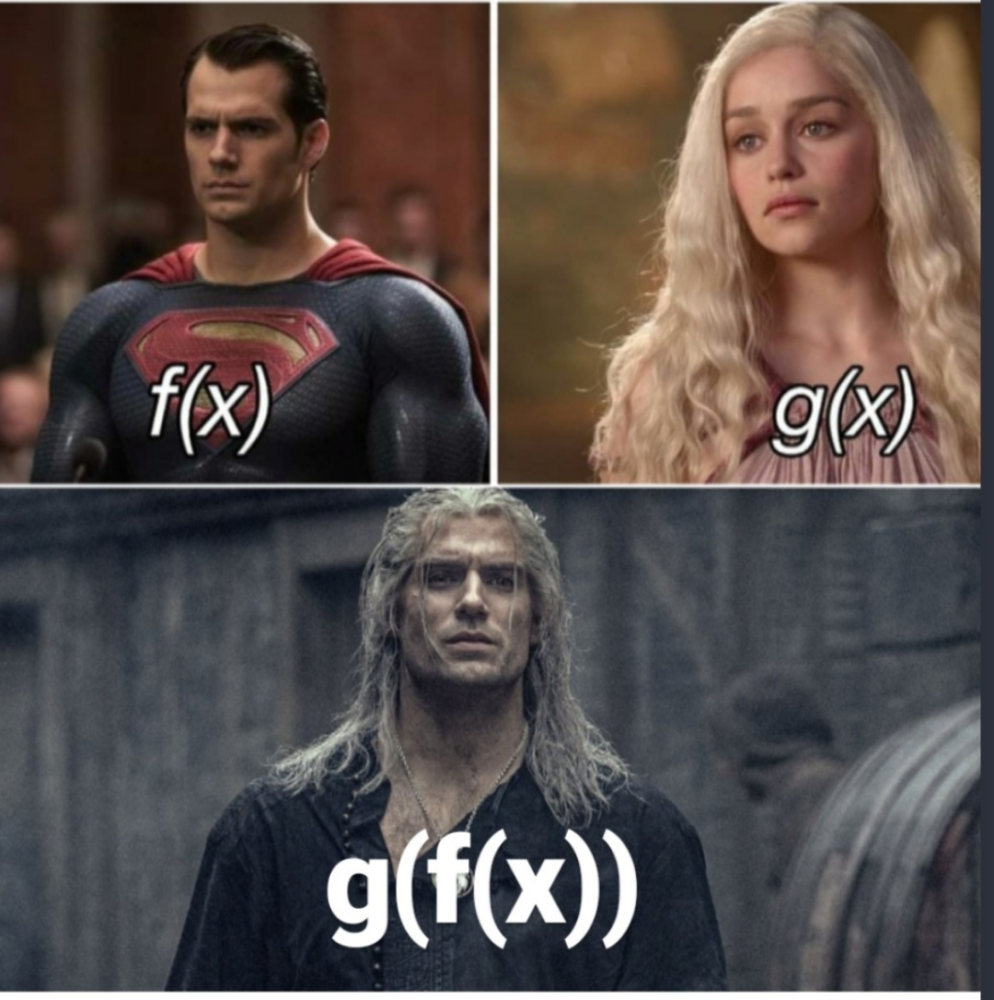
</center>

## Tabela de frequência

<br>

**Frequência absoluta (fi)**
```{r}
table(penguins_sem_na$species)
```

<br>

**Frequência relativa (fri)**
```{r}
prop.table(table(penguins_sem_na$species)) * 100
```

## Tabela de frequência

<br>

**Frequência absoluta (fi)**
```{r}
table(penguins_sem_na$species)
```

<br>

**Frequência relativa (fri)**
```{r}
round(prop.table(table(penguins_sem_na$species)), 4) * 100
```

## Tabela de frequência

<br>

**Frequência absoluta de duas colunas (fi)**
```{r}
table(penguins_sem_na$species, penguins_sem_na$island)
```

**Frequência relativa de duas colunas (fri)**
```{r}
round(prop.table(table(penguins_sem_na$species, penguins_sem_na$island)), 4) * 100
```

## Para se aprofundar

<br>

- `cumsum`: função para soma cumulativa
- `cut`: função para dividir uma sequencia de valores em intervalos
- [`janitor`](https://sfirke.github.io/janitor/index.html): pacote com funções para limpar bases de dados e fazer tabelas de frequência

<center>

</center>

# Dúvidas?


## Medidas-resumo

**Medidas de posição**

<center>
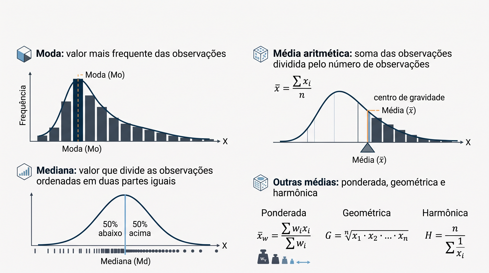
</center>

::: footer
[Gemini](https://gemini.google.com/app/2db1fc6567b495ee)
:::

## Medidas-resumo

**Medidas de dispersão**

<center>
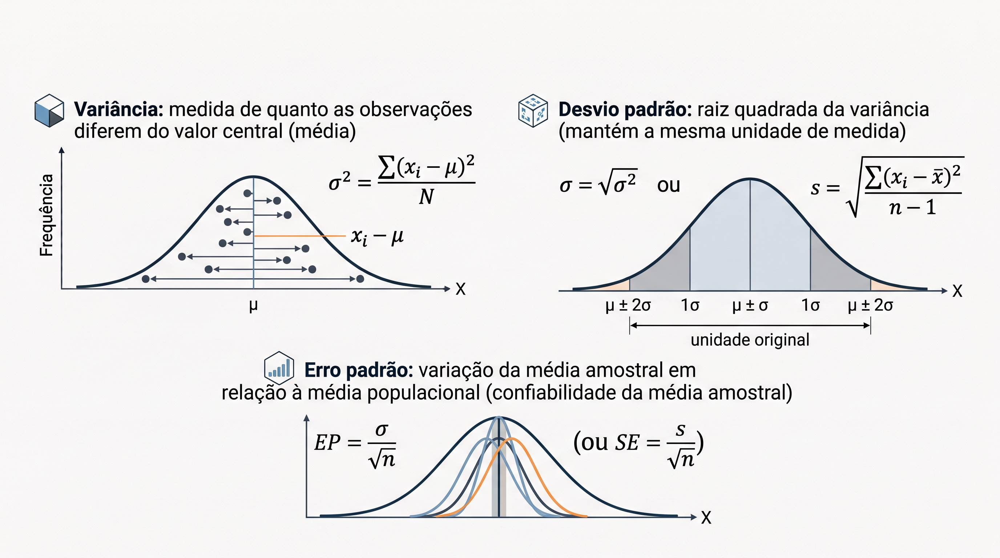
</center>

::: footer
[Gemini](https://gemini.google.com/app/2db1fc6567b495ee)
:::

## apply {.smaller}

- Função nativa no R que aplica uma função sobre as margens de um array ou matriz
- **Sintaxe**:

```{r eval=FALSE}
apply(X, MARGIN, FUN, ...)
```

- `X`:  matriz, data frame ou array em que será aplicada a função
- `MARGIN`: valor indica a margem onde a função será aplicada (1 = linhas ou 2 = colunas)
- `FUN`: função que será aplicada

- **Exemplo**:

```{r}
# matriz
m <- matrix(1:9, nrow = 3, byrow = TRUE)
m 

# funcao mean nas linhas (MARGIN = 1)
m_mean_row <- apply(m, 1, mean)
m_mean_row
```

## apply {.smaller}

<center>
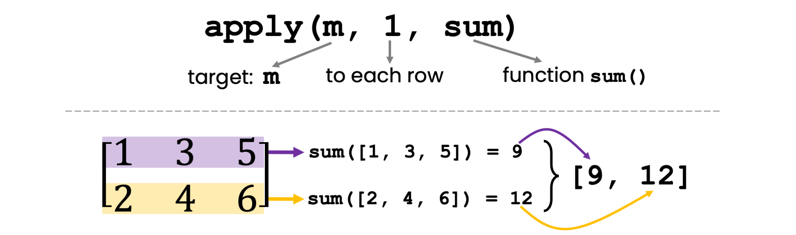
</center>

```{r}
m <- matrix(c(1, 3, 5, 2, 4, 6), ncol = 3, byrow = TRUE)
m

apply(m, 1, sum)
```

## Família apply

- Aplicam uma **função** a elementos de estruturas de dados como vetores, listas, matrizes ou data frames **de forma eficiente**, evitando laços

```{r eval=FALSE}
# familia apply
apply(X, MARGIN, FUN, ...)
lapply(X, FUN, ...)
sapply(X, FUN, ...)
vapply(X, FUN, FUN.VALUE, ...)
tapply(X, INDEX, FUN, ...)
mapply(FUN, ..., MoreArgs = NULL)
rapply(object, f, classes = "ANY", how = "replace")
```

## lapply

- Aplica uma função a cada elemento de uma lista ou vetor, retornando sempre uma lista

- **Exemplos**

```{r}
# lista
x <- list(a = 1:5, b = 6:10)
x

lapply(x, mean)  # media de cada lista - retorna lista
```

## sapply

- Similar a `lapply`, retornando matriz, vetor ou lista (ele escolhe...)
- **Exemplos**

```{r}
# lista
x <- list(a = 1:5, b = 6:10)
x

sapply(x, mean)  # media de cada lista - retorna o que quiser...
```

## vapply

- Similar a sapply, mas permite definir o tipo de retorno
- **Exemplos**

```{r}
# lista
x <- list(a = 1:5, b = 6:10)
x

vapply(x, mean, numeric(1))  # media de cada lista - retorna escolha
```

## tapply

- Aplica função sobre subconjuntos definido por fatores
- **Exemplos**

```{r}
# data frame
df <- data.frame(x = c(rep(1, 3), rep(2, 3)), 
                 f = factor(rep(1:2, each = 3)))
df

tapply(df$x, df$f, sum)  # soma por grupo
```

## mapply

- Aplica função a múltiplos vetores ou listas de forma paralela 
- **Exemplos**

```{r}
# dois vetores
x <- c(1, 2, 3)
y <- c(4, 5, 6)

mapply(sum, x, y) # soma de cada elemento
```

<br>

```{r}
# dois vetores
x <- c(1, 2, 3)
y <- c(4, 5, 6)

mapply(paste0, x, y) # combinacao de cada elemento
```

## rapply

- Função recursiva usada para aplicar uma função a todos os elementos de uma lista (ou estrutura aninhada de listas)
- **Exemplos**

```{r}
# lista
l <- list(a = 4, b = "texto", c = list(d = 25, e = 36))
l
```

## rapply

- Função recursiva usada para aplicar uma função a todos os elementos de uma lista (ou estrutura aninhada de listas)
- **Exemplos**

```{r}
# aplica sqrt() apenas aos elementos numericos
rapply(l, sqrt, classes = "numeric", how = "replace")
```

## rapply

- Função recursiva usada para aplicar uma função a todos os elementos de uma lista (ou estrutura aninhada de listas)
- **Exemplos**

```{r}
# aplica sqrt() e retornando um vetor achatado
rapply(l, sqrt, classes = "numeric", how = "unlist")
```

<br>

```{r}
# usando deflt para retornar NA para elementos nao numericos
rapply(l, sqrt, classes = "numeric", deflt = NA)
```

## Medidas-resumo

<br>

**Média**

```{r}
# media por linhas
apply(penguins_sem_na[1:20, 3:6], 1, mean)
```

<br>

```{r}
# media por colunas
apply(penguins_sem_na[1:20, 3:6], 2, mean)
```

## Medidas-resumo

<br>

**Desvio padrão**

```{r}
# desvio padrao por linhas
apply(penguins_sem_na[1:20, 3:6], 1, sd)
```

<br>

```{r}
# desvio padrao por colunas
apply(penguins_sem_na[1:20, 3:6], 2, sd)
```

## Medidas-resumo

<br>

**Média**

```{r}
# media por especie
tapply(penguins_sem_na$bill_length_mm, penguins_sem_na$species, mean)
```

<br>

```{r}
# media por ilha
tapply(penguins_sem_na$bill_length_mm, penguins_sem_na$island, mean)
```

## Medidas-resumo

<br>

**Desvio padrão**

```{r}
# desvio padrao por especie
tapply(penguins_sem_na$bill_length_mm, penguins_sem_na$species, sd)
```

<br>

```{r}
# desvio padrao por ilha
tapply(penguins_sem_na$bill_length_mm, penguins_sem_na$island, sd)
```

## Para se aprofundar {.smaller}

<br>

- `rowSums` e `colSums`: soma de linhas e colunas
- `rowMeans` e `colMeans`: média de linhas e colunas
- `rowMedians` e `colMedians`: mediana de linhas e colunas
- `rowVars` e `colVars`: variância de linhas e colunas
- `rowMins` e `colMins`: mínimo de linhas e colunas
- `rowMaxs` e `colMaxs`: máximo de linhas e colunas
- `rowProds` e `colProds`: produto de linhas e colunas
- `rowCumsums` e `colCumsums`: soma cumulativa de linhas e colunas 
- `sweep()`: função para subtrair, adicionar, multiplicar ou dividir cada linha ou coluna

# Dúvidas?

## Programação no R

<br>

- **Automatizar** tarefas maçantes...
- Direcionar o **comportamento** dos códigos com base em **condições** ou **repetições**
- **Criar funções** para reutilizar códigos, melhorar organização, reduzir erros e maior generalização

## IMPORTANTE!


## Controle de fluxo

- Muda o comportamento do código com base em **condições**
- Condicionais: `if`, `else` e `else if` 

<center>
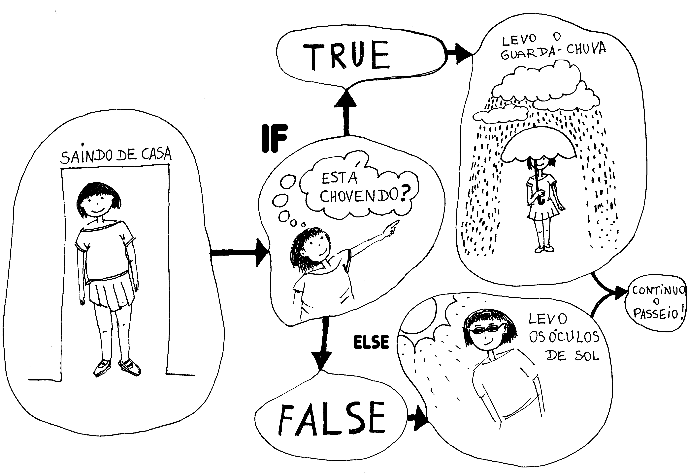
</center>

::: footer
[arteprog arte e programação](https://arteprog.space/programacao-criativa/conteudo/condicionais.html)
:::

## Operadores

**Operadores relacionais (TRUE\|FALSE)**

<br>

| Operador |       Descrição       |   Uso    |
|:--------:|:---------------------:|:--------:|
|    \<    |         Menor         |  a \< b  |
|    \>    |         Maior         |  a \> b  |
|    ==    |         Igual         |  a == b  |
|   \<=    |    Menor ou igual     | a \<= b  |
|   \>=    |    Maior ou igual     | a \> = b |
|    !=    | Não igual (diferente) |   a!=b   |

## Operadores

**Operadores lógicos (TRUE\|FALSE)**

<br>

| Operador |       Descrição       |   Uso    |
|:--------:|:---------------------:|:--------:|
|     !    | Lógico NÃO            |    !a    |
|     &    | Lógico E (elementar)  |   a & b  |
|    \|    | Lógico OU (elementar  |  a \| b  |
|    &&    | Lógico E (primeiro)   |  a && b  |
|    \|\|  | Lógico OU (primeiro)  | a \|\| b |

## if

- Se uma condição for **verdadeira**, faça ...

```{r}
# valor
x <- 10

# condicao
x > 5

# teste
if(x > 5){
    
    print("x é maior que 5")
    
}
```

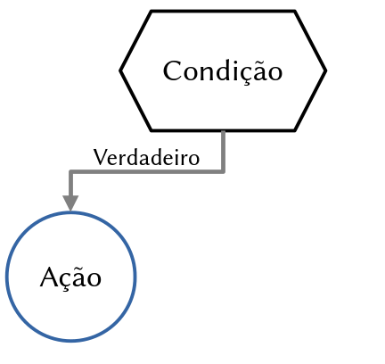{.absolute right="-85" top="325"}

## if

- Se duas condições forem **verdadeiras**, faça ...

```{r}
# valores
x <- 10
y <- 10

# condicao
x > 5 & y > 8

# teste
if(x > 5 & y > 8){
    
    print("x e y são maiores que 5")
    
}
```

{.absolute right="-85" top="325"}

## if

- Se algo menos uma condição for **verdadeira**, faça ...

```{r}
# valores
x <- 10
y <- 2

# condicao
x > 5 | y > 8

# teste
if(x > 5 | y > 8){
    
    print("x ou y é maior que 5")
    
}
```

{.absolute right="-85" top="325"}

## if e else

- Se uma condição for **verdadeira**, faça ...
- Se não (**falso**), faça ...

```{r}
# valor
x <- 3

# condicao
x > 5

# teste
if(x > 5){
    print("x é maior que 5")
} else{
    print("x é menor ou igual a 5")
}
```

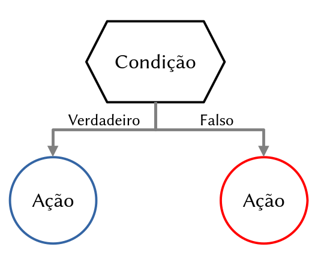{.absolute right="-185" top="300"}

## else if

- Se uma condição for **verdadeira**, faça ...
- Se não (**falso**) se for **verdadeiro**, faça ...
- Se não (**falso**), faça ...

```{r}
x <- 7
if(x > 10){
    print("x é maior que 10")
} else if(x > 5){
    print("x está entre 6 e 10")
} else{
    print("x é 5 ou menor")
}
```

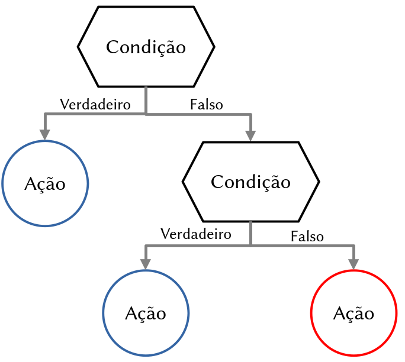{.absolute width="600" height="500" right="-200" top="200"}

# Dúvidas?

## Estruturas de repetição

- Executa um bloco de código com base em **repetições** 
- Laços: `for`, `while` e `repeat` 
- Controles: `break` e `next`

<center>
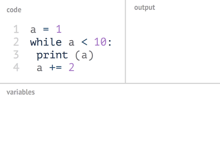
</center>

## for

- **Executa** um bloco de código **`para`** uma **sequência de valores** (vetores ou listas) [*iteração*]

<br> 
```{r}
# for
for(i in 1:10){
    print(i)
}
```

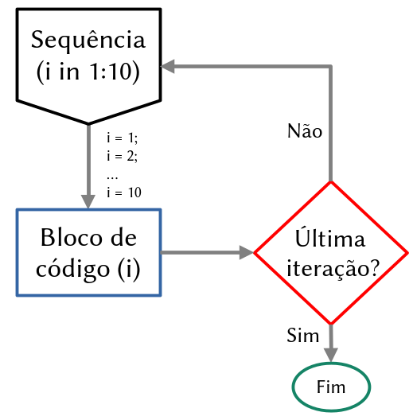{.absolute right="-200" top="180"}

## for

- **Executa** um bloco de código **`para`** uma **sequência de valores** (vetores ou listas) [*iteração*]

<br> 
```{r}
# for
prog <- c("R", "python", "julia", "Fortran")
for(i in prog){
    print(i)
}
```

{.absolute right="-200" top="180"}

## while

- **Executa** um bloco de código **`enquanto`** uma condição é **verdadeira**

```{r}
# while
x <- 1
while(x <= 5){
    print(x)
    x <- x + 1  # atualiza o x
}
```

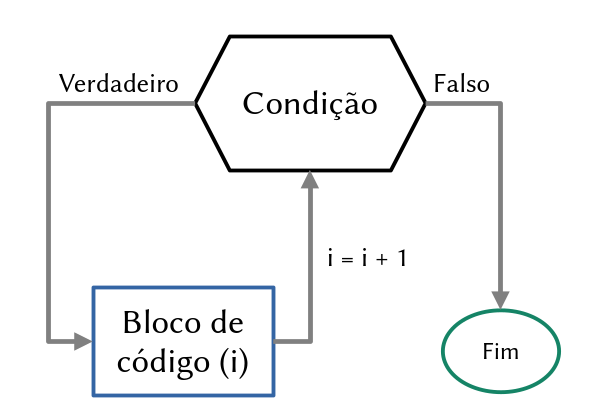{.absolute right="-200" top="200"}

## repeat

- **Executa** um bloco de código **`repetidamente`** até que uma condição de parada (`break`) seja **atendida**

```{r}
# repeat
x <- 1
repeat{
    print(x)
    x <- x + 1
    if(x > 5){
        break  # para o loop para x > 5
    }
}
```

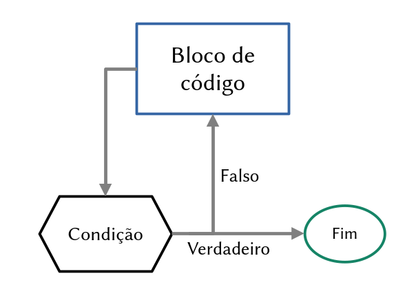{.absolute right="-200" top="200"}

## break

- Usado para **sair** de um laço antes que ele complete todas as iterações

```{r}
# break
for(i in 1:10){
    if(i == 6){
        break  # sai do laco quando i for igual a 6
    }
    print(i)
}
```

## next

- Usado para fazer o laço **pular** a próxima iteração sem executar o código que vem após ele

```{r}
# next
for(i in 1:5){
    if(i == 3){
        next  # pula o numero 3
    }
    print(i)
}
```

## Controle de fluxo e repetição

### for

```{r}
# for e if/else
for(i in 1:10){
    
    if(i %% 2 == 0){
        print(paste(i, "é par"))
    } else{
        print(paste(i, "é ímpar"))
    }
}

```

## Controle de fluxo e repetição

### while

```{r}
# while e if/else
x <- 1
while(x <= 10){
    
    if(x %% 2 == 0){
        print(paste(x, "é par"))
    } else{
        print(paste(x, "é ímpar"))
    }
    x <- x + 1
}
```

## Usos avançados do for

- Exportar ou criar **arquivos** 'colando' o iterador

```{r}
arquivo <- "arquivo"

for(i in 1:10){
    
    print(paste(arquivo, i, sep = "_"))
    
}
```

## Usos avançados do for

- Exportar ou criar **arquivos** 'colando' o iterador

```{r}
arquivo <- "arquivo"

for(i in 1:10){
    
    print(paste0(arquivo, i))
    
}
```

## Usos avançados do for

- Iterando sobre **elementos** de uma lista
- `i` assume o **valor** dos elementos

```{r}
prog <- c("R", "python", "julia", "Fortran")

for(i in prog){
    print(i)
    
}
```

## Usos avançados do for

- Iterando sobre **posição** dos elementos de uma lista
- `i` assume a **posição** dos elementos

```{r}
prog <- c("R", "python", "julia", "Fortran")

for(i in 1:length(prog)){
    
    print(i)
    print(prog[i])
    
}
```

## Usos avançados do for

- Combinando resultados em um **objeto vazio**

```{r}
x <- c(1, 4, 9, 16)

obj <- NULL

for(i in x){
    
    raiz <- sqrt(i)
    obj <- c(obj, raiz)
}
obj
```

## Usos avançados do for

- Combinando resultados em um objeto vazio pela **posição**

```{r}
x <- c(1, 10, 100, 1000)

obj <- NULL

for(i in 1:length(x)){
    
    obj[i] <- log10(x[i])
}
obj
```

## Usos avançados do for

- Combinando resultados em um objeto vazio por **linhas**

```{r}
df <- data.frame()

for(i in 1:5){
    
    q <- i^2
    c <- i^3
    res <- data.frame(numero = i, quadrado = q, cubo = c)
    df <- rbind(df, res)
}
df
```

## Usos avançados do for

- Combinando resultados em um objeto vazio por **colunas**

```{r}
df <- data.frame(numero = 1:5)

for(i in 1:5){
    
    res <- i * 1:5
    df_res <- data.frame(res)
    colnames(df_res) <- paste0("mult", i)
    df <- cbind(df, df_res)
}
df
```

## Funções

- Uma função é um **bloco de código** que realiza uma tarefa específica

- Possui **entradas** (argumentos) e retorna **saídas** (resultados)

- Utilizada para evitar **repetição de código**, tornando-o mais **organizado** e **reutilizável**

{.absolute width="400" height="400" right="0" top="340"}

## Estrutura de uma função

- **nome_da_funcao**: nome de escolha da função
- **argumentos**: valores de entrada que a função recebe
- **retorno**: especifica o que a função devolve (`return()`)

```{r}
# estrutura
nome_da_funcao <- function(argumentos){
    # corpo da funcao
    # calculos, operacoes ou processos
    return(resultado)
}
```

## Exemplo de funções

- Funções com um argumento
- Elevar um número ao quadrado

```{r}
# definicao
quadrado <- function(x){
    return(x^2)
}

# uso
quadrado(2)
```

## Exemplo de funções

- Funções com um argumento
- Raiz quadrada de um número

```{r}
# definicao
raiz <- function(x){
    return(x^(1/2))
}

# uso
raiz(4)
```

## Exemplo de funções

- Funções com múltiplos argumentos
- Soma dois números

```{r}
# definicao
soma <- function(a, b){
    return(a + b)
}

# uso
soma(40, 2)
```

## Exemplo de funções

- Argumentos com valores padrão

```{r}
# definicao
saudacao <- function(nome = "Amigo"){
    return(paste("Olá,", nome))
}

# uso
saudacao()
saudacao("Maurício")
```

## Exemplo de funções

- Função com controle de fluxo
- Verificar se um número é par ou ímpar

```{r}
# definicao
par_ou_impar <- function(num){
    if(num %% 2 == 0){
        return("Par")
    } else{
        return("Ímpar")
    }
}

# uso
par_ou_impar(42)
par_ou_impar(23)
```

## Exemplo de funções

- Função com repetições
- Soma sequência de valores

```{r}
# definicao
soma_sequencia <- function(n){
    total <- 0
    for(i in 1:n){
        total <- total + i
    }
    return(total)
}

# uso
soma_sequencia(3)
```

## Exemplo de funções

- O `...` permite passar um número indefinido de argumentos para a função

```{r}
# definicao
soma_variavel <- function(...){
    return(sum(...))
}

# uso
soma_variavel(1, 2, 3, 4)

# uso
soma_variavel(1:100)
```

## Funções externas

- Permite usar uma função em um script separado do script principal
- Carrega e executa código salvo em um arquivo de script externo

```{r}
# arquivo: funcoes_util.R
soma <- function(a, b) {
    return(a + b)
}

multiplicacao <- function(a, b) {
    return(a * b)
}
```

## Funções externas

- Permite usar uma função em um script separado do script principal
- Carrega e executa código salvo em um arquivo de script externo

```{r}
# carrega as funcoes
source("funcoes_util.R")

# uso
res_soma <- soma(3, 5)
res_soma

res_multi <- multiplicacao(3, 5)
res_multi
```

# Desafio

## Desafio

Criar uma função para jogar um dado múltiplas vezes com número de lados definíveis

<center>
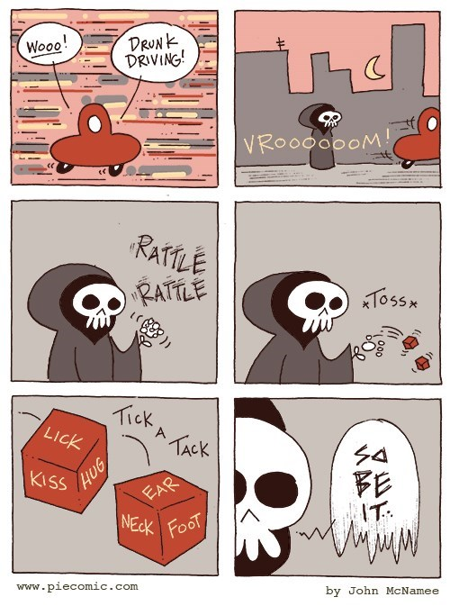
</center>

::: footer
[memebase](https://memebase.cheezburger.com/tag/dice)
:::

## Desafio

**Solução**

```{r}
jogar_dados <- function(jogadas, lados){
    
    dice_resul <- sample(lados, jogadas, replace = TRUE)
    
    return(dice_resul)
        
}
```

# Dúvidas?

## Muito obrigado!

::::: columns
::: {.column width="50%"}
Agradecimentos:

- [Prof. Tadeu Siqueira](https://tsiqueiralab.weebly.com/)
- [Prof. Miltinho](https://leec.eco.br/)
- [Cleber Chaves]()

{.absolute width=40% right=650 top=450}
:::

::: {.column width="50%"}
Contato:

<center>
[mauricio.vancine\@gmail.com]() [mauriciovancine.github.io](mauriciovancine.github.io)

</center>
:::
:::::

::: footer
Slides por [Maurício Vancine](https://mauriciovancine.github.io/), feitos com [Quarto](https://quarto.org/). Código disponível no [GitHub](https://github.com/mauriciovancine/workshop-r-introduction/blob/master/01_slides/slides.qmd).
:::
